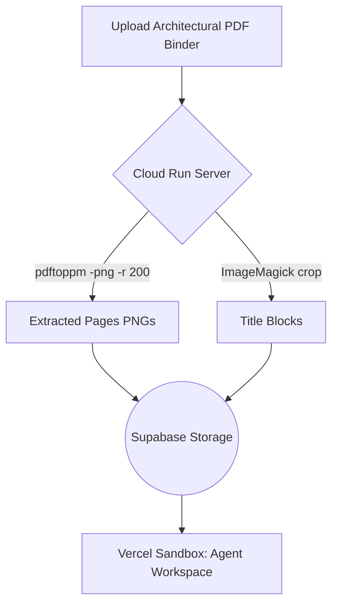
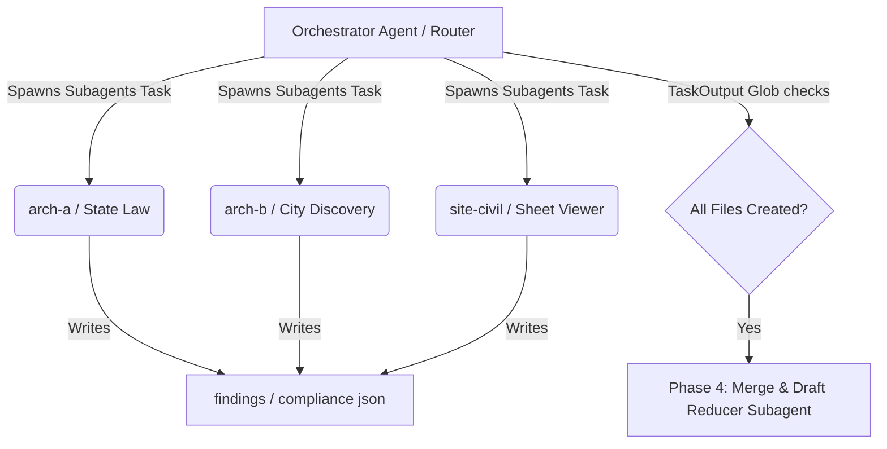

# Crossbeam 架构与落地实现深度分析报告

## 1. [文件解析-数据清洗] 模块深度剖析

### 工具链与依赖
Crossbeam 项目面临的首要挑战是解析超大体积的建筑图纸 PDF 和极难结构化的非标准规范。项目采用了一种“云端预处理 + 沙盒隔离分析”的混合架构：
- **云端预处理 (Cloud Run Server)**：负责图纸的光栅化。在 `server/src/services/extract.ts` 中，使用底层系统依赖 `poppler` (具体命令为 `pdftoppm -png -r 200`) 将数百兆的 PDF 建筑图纸按照 200 DPI 的分辨率提取为逐页的 PNG 图片。
- **元数据剪裁**：同样在 `extract.ts` 中，利用 `ImageMagick` (`identify` 和 `magick/convert -crop`) 对图片右下角（宽 25% × 高 35% 的区域）进行自动裁剪，提取出关键的 Title Block (图框底注)，从而极大地减少了大模型处理无关像素的算力开销。
- 以上操作全部在 Cloud Run 服务端预先完成，产出 `pages-png.tar.gz` 和 `title-blocks.tar.gz`，随后上传至 Supabase Storage，保证了后续 Vercel Sandbox（纯 AI 逻辑层）不需要安装复杂的 C/C++ 图像处理依赖。

### 清洗链路与组装策略
数据的清洗链路呈现显著的“降噪”特征，最终转化为结构化的 JSON 和 Markdown 供大模型理解：
- **Sheet Manifest (图纸索引清单构建)**：
  根据 `adu-skill-development/skill/adu-corrections-flow/SKILL.md` (Phase 2) 和系统 Prompt 配置 `server/src/utils/config.ts` 中的描述，Agent 首先只会去读取图纸的 Cover Sheet (第一页) 以及裁切好的 Title Blocks。这一步的核心目标是构建出一个轻量级的 `sheet-manifest.json`，它维护了图纸逻辑编号 (如 `A3`) 与物理页码 (如 `page-07.png`) 的对应关系。
- **提取与清洗**：对于市府下发的非结构化修正信 (Corrections Letter)，系统直接利用视觉大模型（Vision）逐条读取，并在内存中剥离出具体的条目、引用的规范（如 CRC, CBC）、及图纸引用号，最终序列化为 `corrections_parsed.json`。
- **精准投喂机制 (Targeted Page Viewer)**：通过预先构建的 Sheet Manifest，当且仅当某条修正意见提及了特定图纸（例如“参考详图 2/A3”），Agent 的 Subagent (子代理) 才会去加载对应的 `page-07.png`。这种按需加载 (`adu-targeted-page-viewer` skill) 的策略使得模型避免了一次性吞咽整个几十页的建筑图纸，有效绕开了模型视觉 Token 上限与幻觉问题。

---

## 2. [Agent Harness 架构] 核心引擎剖析

项目没有使用臃肿的 LangChain 等框架，而是基于 `@anthropic-ai/claude-agent-sdk` 在隔离的 Vercel Sandbox 环境中手撸了一套极具特色的 Agent Harness。

### 生命周期与状态机
整个 Agent 运行环境是在按需启动的 Vercel Sandbox 中执行的（详见 `server/src/services/sandbox.ts` 中的 `createSandbox()` 和 `runAgent()`）。
- **长时间运行保障**：传统的 Vercel Serverless Function 极易超时（通常在 60s-300s），系统通过 Cloud Run 作为一个 Orchestrator 来拉起并监控 Vercel Sandbox。沙盒甚至被特意延长了超时时间 (`await sandbox.extendTimeout()`) 以支撑长达 10-30 分钟的审查工作流。
- **状态流转**：Agent 脚本以 detached 模式 (`detached: true`) 运行，将中间状态和对话记录通过 Supabase Realtime (`insertMessage`) 不断推回前端，实现了执行状态的可视化。

### 记忆与防遗忘机制
处理建筑规范动辄几万字的上下文，长文本遗忘是致命的。系统在 Prompt 级别实施了极其严格的“隔离”策略。
- 参见 `server/src/utils/config.ts` 中的 `CITY_REVIEW_SYSTEM_APPEND` 与 Prompt 构造逻辑，明确规定主节点 (Orchestrator Agent) **"NEVER read any PNG files... NEVER read large JSON files."**
- **黑板模式 (Blackboard Pattern)**：所有的中间推导过程都不保存在会话 Context 中，而是被强制要求落盘写入沙盒的本地文件系统（即写到 `/vercel/sandbox/project-files/output/` 目录下）。主 Agent 仅通过读取体积极小的目录结构或合并后的短 JSON 摘要来进行下一步决策，这是一种典型的利用 File System 充当长记忆 (Long-term Memory) 的精妙设计。

### 工具箱（Tools/Skills）拓展机制
项目采用了一种 **Skills-First** 架构，摒弃了传统的向量数据库 RAG，而是通过将专家知识库编译为结构化 Markdown 的方式热插拔：
- 在 `server/src/utils/config.ts` 中的 `getFlowSkills` 函数定义了针对不同审查阶段（如 `city-review` 或 `corrections-analysis`）和不同城市动态注入的 Skills（例如：`california-adu`, `adu-targeted-page-viewer`, 或特定城市的 `placentia-adu`）。
- 启动 Sandbox 时 (`server/src/services/sandbox.ts` 的 `copySkillsToSandbox`)，系统将这些存放在 `.claude/skills/` 下的 Markdown 文件连同 Prompt 指令物理拷贝至沙盒目录。Agent 底座内置的 `claude_code` preset 会自动将它们解析为当前上下文可调用的工具集合。

### 多 Agent 协作网络
这是一个典型的 **Router - Worker - Reducer** 架构（参考 `server/src/utils/config.ts` 中的 Prompt 定义和 `SKILL.md` 文档）：

1. **Orchestrator (主节点/Router)**：负责整体调度，读取 Manifest，划分任务。
2. **Workers (执行节点)**：主节点通过启动子任务（Task / TaskOutput）发起并行的执行链。例如在审查阶段（Phase 2），Orchestrator 会并发拉起 5 个领域特定的 Subagent：
   - `arch-a` (建筑前段)
   - `arch-b` (建筑后段)
   - `site-civil` (总图与土建)
   - `structural` (结构)
   - `mep-energy` (机电与节能)
   这些 Worker 彼此隔离，只拿到自己关心的图纸页码和对应的审查清单，并独自输出 `findings-{discipline}.json`。在修正意见分析阶段 (Phase 3)，同样并发启动 `State Law Researcher`, `City Discovery` 和 `Sheet Viewer` 三个 Subagent。
3. **Critic 与协议通信**：Agent 之间不通过消息总线直接对话，而是通过共同的“文件系统”作为媒介。Orchestrator 在拉起 Subagent 时传入具体的输入文件路径和预期输出路径，通过轮询或者等待任务结束（`TaskOutput`）后，通过 `Glob` 检查文件是否存在。

---

## 3. [成果交付] 数据闭环还原

### 中间态管理
多 Agent 并发跑出的临时数据并没有直接抛给用户，而是以中间 JSON 文件的形式缓存在沙盒磁盘上。
例如（参见 `adu-skill-development/skill/adu-corrections-flow/SKILL.md`）：
- `state_law_findings.json` (州立法规的原始比对结果)
- `city_discovery.json` (市政府相关网站 URL 的发现清单)
- `sheet_observations.json` (特定图纸上看到的原始内容描述)

### 合并与升华（Reduce 过程）
系统设定了专门的“收敛”阶段 (Phase 4: Merge & Draft) 来榨取大模型的分析价值并剔除“脏数据”：
- **数据清洗与降噪**：在 `server/src/utils/config.ts` 中定义的 `PHASE 4` Agent 会读取之前所有的 `findings-*.json`。系统赋予了该节点严格的“自我反思/逻辑校验”规则（例如：“Include findings confirmed by state AND/OR city code with code citation”, “DROP subjective findings — ADUs subject to objective standards only”）。
- **分类与降维**：该节点会将成百上千条零散的审查点交叉对比，并将它们分类：

| 类别 (Category) | 含义 | 处理策略 |
|---|---|---|
| `AUTO_FIXABLE` | 仅需修改图纸备注即可解决 | Agent 自动生成修正文案记录在案。 |
| `NEEDS_CONTRACTOR_INPUT` | 需要包工头补充现场数据 | 衍生成具体的问答表单，返回前端供业务人员填写。 |
| `NEEDS_PROFESSIONAL` | 必须重新出图 | 提取并封装给对应的专业工程师处理。 |

这些高质量的数据最终被收敛进 `corrections_categorized.json`。

### 最终输出：打通“最后一公里”
系统设计了一个无缝衔接业务的后续执行流 (`corrections-response`，由 `adu-skill-development/skill/adu-corrections-complete/SKILL.md` 驱动)：
- 当用户（包工头）在前台补齐了 `NEEDS_CONTRACTOR_INPUT` 的答案后（形成 `contractor_answers.json`），系统会触发一个 **Cold Start (冷启动)** 的汇总 Agent。
- 这个 Agent 不再进行昂贵的图像识别或法律条文搜索，而是单纯地将 `corrections_categorized.json` 的深度分析与 `contractor_answers.json` 的业务事实做关联，最终在沙盒中吐出高度业务友好的 Markdown 与 JSON 数据：

| 交付文件 | 用途与业务价值 |
|---|---|
| `response_letter.md` | 一封正式的致市政规划局的规范答复函。 |
| `professional_scope.md` | 给到结构工程师或设计师的具体改图工作包（例如：明确告知哪一页的哪个节点需要补齐怎样的防火材料参数）。 |
| `corrections_report.md` | 给项目经理查看的看板与 Checklist。 |
| `sheet_annotations.json` | 精确到图纸物理页码与坐标的批注数据（为后续前端高亮或渲染 PDF 做准备）。 |

- 最后，`server/src/services/sandbox.ts` 中定义的 `runAgent()` 里的 `RESILIENT UPLOAD PHASE` 会读取这些业务产物，并批量打包上云（Supabase），完成整条 AI 建筑审查数据链路的闭环。