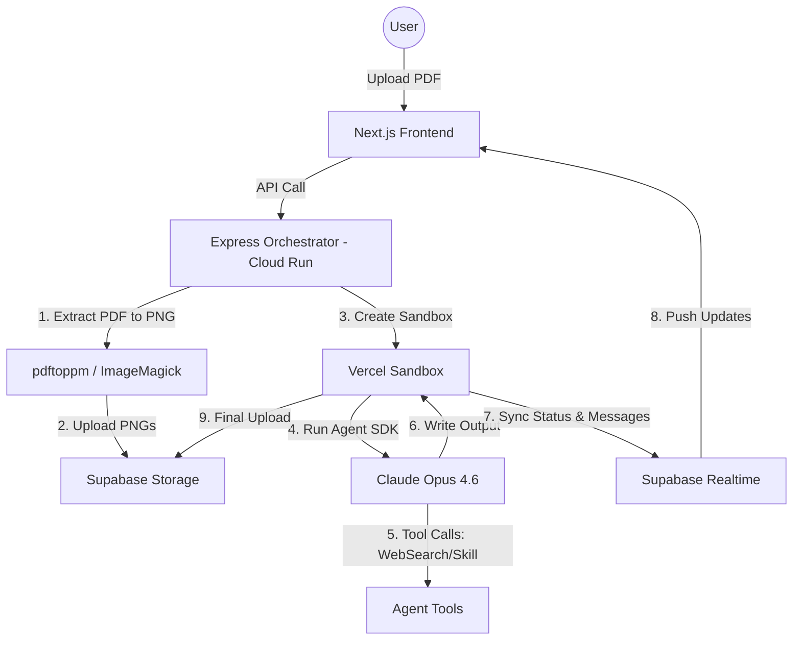
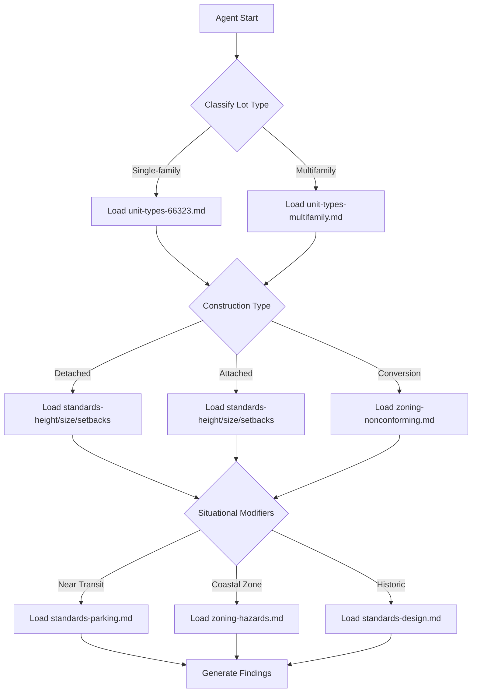

# CrossBeam 全量代码扫描与深度架构分析报告

## 1. 项目概览与核心价值

CrossBeam 是 Anthropic "Built with Opus 4.6" 全球黑客松的冠军项目，由加州律师 Mike Brown 开发。它是一个 AI 驱动的加州 ADU（Accessory Dwelling Unit，附属住宅单元）建筑许可审查助手，旨在解决加州复杂的建筑审批流程。

### 1.1 核心痛点与问题定义
*   **极高的退回率**：在加州，ADU 建筑许可在首次提交时的**退回率高达 90% 以上**。
*   **非技术性错误**：绝大多数退回并非因为结构工程或建筑设计失败，而是由于官僚主义细节：缺少签名、错误的法规引用、表格填写不完整等。
*   **高昂的时间成本**：许可审批平均延迟 6 个月，这为房主带来了约 **$30,000** 的额外持有成本。
*   **专业知识门槛**：承包商通常是建造者而非法律专家，难以解析动辄几十页的州政府法规和城市市政法典。

### 1.2 CrossBeam 的解决方案
CrossBeam 利用 Claude Opus 4.6 的视觉和逻辑推理能力，构建了一个全自动化的 Agent 流程：
*   **Flow 1: 修改函解读器 (Corrections Letter Interpreter)**：承包商上传城市退回的修改函（PDF/图片）和原始建筑图纸。Agent 自动识别修改项，对比加州 ADU 法律（Gov. Code §§ 66310-66342），搜索城市特定法规，并生成专业的回复包（包含回复信、专业工作范围、修改报告）。
*   **Flow 2: 许可核对单生成器 (Permit Checklist Generator)**：根据项目地址，Agent 实时搜索城市特定的准入要求，结合州法律，生成开工前的完整核对单。
*   **Flow 3: 城市预审助手 (Roadmap)**：设想中为城市审批人员提供的工具，在人工介入前自动发现 90% 的基础错误。

### 1.3 核心价值与商业逻辑
CrossBeam 的成功在于其精准的切入点：**将 AI 视为“法规专家”和“审稿人”**。
*   **降本增效**：将 6 个月的往返缩短到几周，节省数万美元。
*   **专业赋能**：让承包商拥有律师般的法规分析能力。
*   **领域高度重合**：它与我们的 Compliance-Copilot 项目在本质上是一致的——**用 AI 解析复杂规制并生成合规性文档**。CrossBeam 证明了在该领域，基于特定领域知识（Skills）的 Agent 能够产出极高质量的专业输出。

## 2. 系统架构深度分析

CrossBeam 采用了典型的高性能 AI Agent 异步处理架构，旨在解决长耗时 Agent 任务与 Web 实时反馈之间的矛盾。

### 2.1 四层分层架构
根据 `README.md` 和 `server/src/services/sandbox.ts`，系统的完整数据流如下：

1.  **Frontend (Next.js 16)**: 用户界面，负责文件上传、状态展示（Supabase Realtime）和最终结果渲染。
2.  **Orchestrator (Express on Cloud Run)**: 后端编排器。接收请求后，首先在 Cloud Run 本地环境执行繁重的 PDF 处理任务（`pdftoppm`），然后启动 Vercel Sandbox。
3.  **Vercel Sandbox (Agent SDK + Opus 4.6)**: 隔离的临时执行环境。每个 Agent 任务都在一个独立的、具有完整文件系统访问权限的沙箱中运行。
4.  **Supabase (DB, Storage, Realtime)**: 数据中心。存储项目状态、文件、Agent 运行日志和最终生成的 Deliverables。

### 2.2 核心设计决策：为什么需要 Cloud Run + Vercel Sandbox？
在 `progress.md` 和 `server/src/services/sandbox.ts` 中可以发现关键决策：
*   **绕过超时限制**：Vercel Serverless Function 的超时时间通常在 60-300 秒，而一个完整的 ADU 审查流程（包含视觉读取、多重搜索和逻辑推理）通常需要 **10-30 分钟**。Cloud Run 允许长连接，且手动将超时时间设为了 60 分钟（见 `progress.md`）。
*   **计算卸载**：PDF 转换为高分辨率 PNG 极其消耗内存（26 页建筑图纸在 200 DPI 下非常巨大）。Vercel Sandbox 只有 4GB 内存，难以胜任。因此，CrossBeam 将 PDF 提取环节放在了具有系统级工具（poppler-utils, ImageMagick）的 Cloud Run 上执行。
*   **环境隔离**：使用 Vercel Sandbox (`@vercel/sandbox`) 确保了每个 Agent 拥有干净的临时工作空间，可以使用 `claude_code` preset 的全部工具（如 Bash, Write, Read）。

### 2.3 数据流图 (Mermaid)

### 2.4 实时性保证
CrossBeam 摒弃了传统的轮询（Polling）方案，全面采用了 **Supabase Realtime**。Agent 在沙箱中通过 SDK 插入消息到 `messages` 表，前端通过监听对应的 `project_id` 实时同步 Agent 的“思考”过程（见 `frontend/components/agent-stream.tsx`）。这极大地提升了用户在漫长等待过程中的确定性。

## 3. AI Agent 实现详解

CrossBeam 深度集成了 Anthropic 的 **Claude Agent SDK**。这不仅仅是调用 API，而是利用 SDK 提供的 `claude_code` 预设，使 Agent 能够像开发者一样操作文件、运行命令。

### 3.1 Agent SDK 配置分析
在 `server/src/utils/config.ts` 中定义的 `createQueryOptions` 是核心配置：
*   **preset: 'claude_code'**：关键选项。这让 Agent 自动获得了读取/写入文件、运行 Bash 命令、执行 Web 搜索的能力。如果没有这个预设，Agent 会幻觉出工具调用但无法执行。
*   **permissionMode: 'bypassPermissions'**：由于是自动化运行，禁用了交互式权限确认。
*   **maxBudgetUsd**：为每个流设置了预算上限（如 `$50.00`），防止长任务失控消耗过多 Token。
*   **systemPrompt.append**：注入了 CrossBeam 特定的约束，例如“你是一个纯粹的编排者，不要在大上下文里直接读取大型图片，要派生子 Agent 任务”。

### 3.2 任务拆解与 `claude-task.json`
项目采用了“分阶段任务追踪”模式（见 `agents-crossbeam/claude-task.json`）。这种模式将复杂的端到端任务拆分为离散的 Phase：
*   **Phase 1-2**：读取修改函、建立图纸索引（Sheet Manifest）。
*   **Phase 3**：三方并行研究（州法律、城市发现、图纸观测）。
*   **Phase 4**：合并、分类并生成承包商提问。

### 3.3 主提示词 (`claude-prompt.md`) 结构
`agents-crossbeam/claude-prompt.md` 展示了极高水平的 Prompt 工程：
*   **角色定义 (Role)**：不仅定义为“ADU 许可助手”，还明确了“Agent SDK 后端”的身份。
*   **验证驱动 (Verification-Driven)**：要求 Agent 每完成一个 Phase 必须停止并输出验证步骤。
*   **工具约束 (Rule)**：明确指出 Agent SDK 与 CLI 版本的区别，确保 Agent 不会尝试使用环境里不存在的工具。

### 3.4 并行化与子任务管理 (`Task` Tool)
为了提高速度，CrossBeam 大量使用子任务。例如在 `adu-corrections-flow` 中：
*   它会同时启动三个 subagents：`Subagent 3A (State Law)`, `Subagent 3B (City Discovery)`, `Subagent 3C (Sheet Viewer)`。
*   主 Agent 负责协调，利用 `Task` 工具分发任务，然后使用 `TaskOutput` 等待结果合并。这种“分而治之”的策略是处理 20+ 页复杂 PDF 的唯一可行方法。

## 4. 大文件/图纸处理策略

处理高分辨率建筑 PDF 是 CrossBeam 最核心的技术挑战，也是其最惊艳的设计点。

### 4.1 视觉管道 (Vision Pipeline)
在 `server/src/services/extract.ts` 中可以看到完整的预处理逻辑：
1.  **PDF → PNG (200 DPI)**：使用 `pdftoppm` 将 PDF 的每一页转换为高分辨率 PNG。这保证了视觉模型能看清极小的标注。
2.  **标题栏裁剪 (Title Block Cropping)**：建筑图纸的核心信息（图号、图名、版本、设计师）通常在右下角。系统自动裁剪右下角 25%x35% 的区域（见 `extract.ts` 中的 `magick` 命令），专门供 Agent 快速识别。
3.  **打包上传**：将处理后的 PNG 打包成 `.tar.gz` 上传到 Supabase，供沙箱内的 Agent 快速下载解压。

### 4.2 智能索引与“针对性查看” (Sheet Manifest Strategy)
开发者在 `progress.md` 中记录了一个关键转折：**从“全量提取”转向“针对性查看”**。
*   **初试失败**：最初尝试通过视觉提取每页的所有文字，耗时 35 分钟，准确率仅 95%（无法满足 100% 精确的工业要求）。
*   **优化策略 (adu-targeted-page-viewer)**：
    *   Agent 先只看**封面页 (Cover Sheet)** 获取图纸索引。
    *   通过读取小巧的标题栏裁剪图，快速建立 `sheet-manifest.json`（如：第 4 页是 A1 平面图，第 7 页是 A3 立面图）。
    *   **按需读取**：只有当修改函提到“修改 A3 图纸”时，Agent 才会在子任务中读取对应的第 7 页 PNG。

### 4.3 与 pdf-parse 方案的对比
| 维度 | Compliance-Copilot (pdf-parse) | CrossBeam (Vision Pipeline) |
| :--- | :--- | :--- |
| **技术基础** | 纯文本提取 | OCR + 视觉模型 (Opus 4.6 Vision) |
| **适用范围** | 纯文本合同、规范文档 | 包含大量 CAD 图形、图表、印章的建筑图纸 |
| **精度** | 极高（文本层面） | 极高（空间关系、视觉元素层面） |
| **成本/耗时** | 极低（秒级，忽略不计） | 较高（分钟级，Opus 视觉 Token 昂贵） |
| **优势** | 搜索速度快，易于 RAG | 能理解“图纸右下角的印章是否缺失”等视觉逻辑 |

**结论**：对于建筑、制造、医疗等强依赖图纸的行业，Vision 管道是不可逾越的护城河。CrossBeam 证明了**预处理（裁剪、索引）+ 按需视觉读取**是目前处理超大 PDF 的最佳实践。

## 5. Skills-First 架构设计

CrossBeam 的核心理念是 **Skills over RAG**。它没有使用传统的向量数据库检索，而是构建了一个结构化的“技能系统”。

### 5.1 什么是 Skills？
在 CrossBeam 中，Skill 是一组存储在 `.claude/skills/` 下的结构化 Markdown 文件集。
*   **不仅仅是 Prompt**：Skill 包含背景知识、决策逻辑（SKILL.md）和具体的规则参考（references/）。
*   **层级架构**：开发者在 `adu-skill-development/plan-skill-aduHandbook.md` 中定义了三层架构：
    1.  **Federal Layer**: 联邦法律（暂未实现）。
    2.  **State Layer (california-adu)**: 州级最低标准（这是 CrossBeam 的地基）。
    3.  **City Layer (adu-city-research)**: 各市特定标准。

### 5.2 决策树路由器 (Decision Tree Router)

`adu-skill-development/skill/california-adu/SKILL.md` 实现了一个非常精妙的决策树：
1.  **Step 1: Classify Lot Type** (Single-family vs Multifamily).
2.  **Step 2: Classify Construction Type** (Detached vs Conversion vs Attached).
3.  **Step 3: Check Situational Modifiers** (Transit area, Fire hazard, Historic district).
4.  **Step 4: Check Process/Fees**.

这种设计避免了将所有 54 页法规一次性塞入 Context，而是引导 Agent **按需加载特定的参考文件**。

### 5.3 城市研究三模式 (Three-Mode City Research)
`adu-city-research` 技能展示了如何处理极其碎片化的外部数据：
*   **Mode 1: Discovery (WebSearch)**：仅搜索并寻找关键 URL（市政法典、标准图集、部门公告）。
*   **Mode 2: Targeted Extraction (WebFetch)**：对特定 URL 进行内容提取。
*   **Mode 3: Browser Fallback (Chrome MCP)**：对于复杂的、有反爬或交互要求的政府网站，动用真实浏览器。

### 5.4 优势：确定性与透明度
与 RAG 的“黑盒”检索相比，Skills 架构具有：
*   **100% 召回率**：Agent 明确知道哪些文件可用。
*   **明确的逻辑路径**：开发者可以强制 Agent 遵循特定的法律分析流程。
*   **易于维护**：更新法规只需修改 Markdown 文件，无需重新训练或嵌入向量。

## 6. 完整技术栈分析

### 6.1 技术选型表
| 层次 | 技术 | 关键特性 |
| :--- | :--- | :--- |
| **Frontend** | Next.js 16 (App Router) + React 19 | 最新性能特性，React 19 Server Components |
| **UI Framework** | Shadcn/UI + Tailwind CSS 4 | 极速样式构建，Tailwind 4 性能大幅提升 |
| **Backend** | Express 5 | 运行在 Google Cloud Run，处理长耗时任务 |
| **AI Runtime** | Vercel Sandbox | 隔离的 Agent 执行环境，每个任务一个沙箱 |
| **Agent Core** | Claude Agent SDK + Opus 4.6 | 支持子任务（Task工具）和 200k 上下文 |
| **Database** | Supabase (Postgres) | 存储项目元数据和结果 |
| **Realtime** | Supabase Realtime | 基于 Postgres WAL 的即时消息推送 |
| **Storage** | Supabase Storage | 存储原始 PDF、处理后的 PNG 和结果 Deliverables |
| **PDF Extraction**| poppler-utils (pdftoppm) | Cloud Run 本地二进制工具 |

### 6.2 CrossBeam vs. Compliance-Copilot
| 特性 | CrossBeam | Compliance-Copilot (当前) |
| :--- | :--- | :--- |
| **主模型** | Claude Opus 4.6 | Claude 3.5 Sonnet / GPT-4o |
| **处理耗时** | 10 - 30 分钟 (异步) | 30 - 60 秒 (流式/同步) |
| **图纸支持** | 深度视觉支持 (PNG + Vision) | 纯文本支持 (pdf-parse) |
| **法规存储** | Skills (结构化 Markdown) | 数据库 RAG (向量检索) |
| **交互模式** | Agentic (多步骤自主运行) | Chat-based (单次问答) |
| **中间反馈** | 全流程日志流 (Realtime) | 仅流式生成 (Streaming) |
| **运行环境** | 专用 Sandbox | Serverless Function |

## 7. 每个 Claude Skill 的详细分析

CrossBeam 共有 15 个主要的 Claude Skill（在 `.claude/skills/` 下），其中核心业务技能 6 个。

### 7.1 核心业务技能
1.  **california-adu (加州 ADU 法规)**:
    *   **定位**：全系统的“法律底座”。它包含了加州政府关于 ADU 的所有强制性规定。
    *   **结构**：由 28 个高度细分的 Markdown 文件组成（位于 `adu-skill-development/skill/california-adu/references/`）。
    *   **具体文件构成分析**：
        *   **Unit Types (单元类型)**: `unit-types-66323.md`, `unit-types-adu-general.md`, `unit-types-jadu.md`, `unit-types-multifamily.md`。详细定义了什么是 ADU、什么是 JADU，以及单户和多户住宅的不同规则。
        *   **Standards (开发标准)**: `standards-height.md` (高度), `standards-size.md` (尺寸), `standards-setbacks.md` (退让距离), `standards-parking.md` (停车位), `standards-fire.md` (消防), `standards-solar.md` (太阳能), `standards-design.md` (设计)。例如，明确了侧向和后向退让距离不得超过 4 英尺（Gov. Code § 66314(d)(7)）。
        *   **Permit & Fees (许可与费用)**: `permit-process.md`, `permit-fees.md`, `permit-funding.md`。涵盖了 60 天审批时限和费用减免政策。
        *   **Zoning & Ownership (规划与所有权)**: `zoning-general.md`, `zoning-hazards.md`, `zoning-nonconforming.md`, `ownership-use.md`, `ownership-sales.md`, `ownership-hoa.md`。解决了 HOA（业主委员会）是否可以禁止 ADU 的关键法律问题。
        *   **Special & Compliance (特殊情况与合规)**: `special-manufactured.md`, `special-sb9.md`, `compliance-unpermitted.md`, `compliance-ordinances.md`, `compliance-housing.md`, `compliance-utilities.md`。
        *   **Glossary & Legislative (术语与立法)**: `glossary.md`, `legislative-changes.md`。
    *   **交互逻辑**：Agent 会根据项目类型（如单户住宅 vs 多户住宅）决定加载哪些文件。这种分而治之的方法确保了 Context Window 的高效利用。
    *   **核心价值**：它提供了“州法优先权（State Preemption）”的逻辑，当城市法规过严时，Agent 能以此为据提醒用户。

2.  **adu-corrections-flow (修改流程编排)**:
    *   **定位**：整个“修改函解读”流程的导演。
    *   **工作流细节**：
        *   **Phase 1**：解析修改函文本，提取每一个 Correction Item。
        *   **Phase 2**：建立图纸索引，将图号（如 A1.1）与 PDF 页码对应。
        *   **Phase 3**：分发子任务。Subagent A 查州法，Subagent B 查市规，Subagent C 针对性看图。
        *   **Phase 4**：合并分析，判断哪些是“自动可修复（AUTO_FIXABLE）”，哪些需要“专家协助（NEEDS_PROFESSIONAL）”。
    *   **代码引用**：见 `agents-crossbeam/src/flows/corrections-analysis.ts`。

3.  **adu-city-research (城市研究)**:
    *   **定位**：解决加州 480 多个城市法规不一的问题。
    *   **搜索策略**：使用特定的搜索指令，如 `"City of [Name]" standard detail sewer connection ADU`，精准定位市政文档。
    *   **平台适配**：针对 ecode360, Municode, QCode 等主流市政代码平台编写了专门的解析逻辑（见 `references/municipal-code-platforms.md`）。

4.  **adu-targeted-page-viewer (针对性图纸查看)**:
    *   **定位**：视觉 Agent 的“眼睛”。
    *   **核心逻辑**：利用图纸右下角的标题栏（Title Block）进行 OCR 识别，建立映射表。当主 Agent 需要看某张图时，它直接调用该技能读取特定页面的高分辨率 PNG。
    *   **优势**：避免了让模型一次性阅读几十页大图，极大地节省了 Token 和处理时间。

5.  **adu-corrections-complete (回复生成)**:
    *   **定位**：流程的最后一步，负责产出。
    *   **交付物定义**：
        *   `response_letter.md`：给城市审批部门的正式回复信。
        *   `professional_scope.md`：给设计师/工程师的工作任务清单。
        *   `corrections_report.md`：项目经理视角的进度报告。
        *   `sheet_annotations.json`：用于未来在 PDF 上自动标注的元数据。

6.  **adu-plan-review (城市端审查)**:
    *   **定位**：模拟城市规划师的审查过程。
    *   **核心逻辑**：加载 `adu-plan-review/references/` 下的审查核对单，对上传的图纸进行逐项合规性扫描。

### 7.2 全量 Skill 目录分析
根据根目录 `.claude/skills/` 的扫描结果，CrossBeam 还包含以下辅助技能：

1.  **cc-guide**:
    *   **功能**：这是开发者的“秘密武器”。它是一个封装了 Anthropic 最新官方文档的知识库。
    *   **价值**：在黑客松期间，API 和 SDK 变化极快，该技能让 Agent 能够查阅实时文档而非依赖过时的训练数据。

2.  **crossbeam-ops**:
    *   **功能**：教 Agent 如何管理已部署的应用。包含触发 API、清理数据库、检查 Vercel Sandbox 状态等指令。

3.  **fal-ai**:
    *   **功能**：集成 fal.ai 接口，用于生成项目演示所需的视觉资产（如 ADU 的等距视角图）。

4.  **frontend-design / shadcn / react-best-practices / skill-creator**:
    *   **功能**：这一系列技能构成了 CrossBeam 的“开发套件”。它们定义了代码编写的标准（如必须使用 Tailwind 4，必须遵循 Shadcn 组件规范）。
    *   **意义**：这保证了即使是由 AI 生成的代码，也具有高度的一致性和可维护性。

5.  **long-running-agent**:
    *   **功能**：专门用于管理那些可能运行数小时的任务。包含进度保存、断点续传的逻辑指导。

6.  **product-demo-video**:
    *   **功能**：包含视频脚本策划、剪辑建议等知识，辅助开发者产出高质量的演示视频。

7.  **nano-banana**:
    *   **功能**：从代码看这是一个实验性或占位技能，体现了黑客松过程中的快速迭代痕迹。

8.  **document-skills**:
    *   **功能**：通用的文档处理能力，如文本清洗、Markdown 转换等。

9.  **demo-city-review / demo-contractor-corrections**:
    *   **功能**：专门用于黑客松演示的技能。它们包含了一些预设的脚本和引导语，确保在录制演示视频时 Agent 能以最完美的路径展示核心功能。

10. **template-skill**:
    *   **功能**：Skill 的模板文件，规定了新 Skill 的标准目录结构（references/, SKILL.md 等）。

### 7.3 Skill 的加载机制
CrossBeam 并没有将所有 Skill 全量注入每个 Session。在 `server/src/utils/config.ts` 的 `getFlowSkills` 函数中，系统根据当前的 `flow_type` 动态计算需要挂载哪些技能。例如：
*   **city-review** 流程只加载 `california-adu`, `adu-plan-review`, 和 `adu-targeted-page-viewer`。
*   这种**按需挂载**的策略极大地节省了 Context 空间，并减少了 Agent 受到无关技能干扰的可能性。

## 8. 前端实现分析

CrossBeam 的前端不仅仅是一个 UI，它更像是一个 **Agent 状态监视器**。

### 8.1 状态驱动的页面渲染 (Project Detail View)
在 `frontend/app/(dashboard)/projects/[id]/project-detail-client.tsx` 中，页面根据项目状态（`ProjectStatus`）动态展示不同组件：
*   **ready**: 显示“启动”按钮和文件预览。
*   **processing**: 显示 **AgentStream**（实时日志）和 **ProgressPhases**（进度条）。
*   **awaiting-answers**: 渲染 **ContractorQuestionsForm**（承包商问答表单）。
*   **completed**: 渲染 **ResultsViewer**（结果预览）。

### 8.2 实时流式日志 (`AgentStream`)
这是 CrossBeam 交互设计的精髓。通过监听 Supabase 的 `messages` 表，前端实时滚动展示 Agent 的工具调用记录（如 `[2.3m] WebSearch — Placentia ADU ordinance`）。这种透明度极大地缓解了用户等待 15 分钟时的焦虑。

### 8.3 等待状态的视觉填充 (`AduMiniature`)
为了让漫长的 Agent 运行过程不再枯燥，开发者设计了 `AduMiniature` 组件（见 `frontend/components/adu-miniature.tsx`）。它展示了一个等距视角（Isometric）的 ADU 建筑模型，并在 Agent 工作时伴随微小的动画，象征着房子正在被“AI 构建”。

### 8.4 结果预览 (`ResultsViewer`)
采用选项卡式设计，展示生成的多个文档（回复信、工作范围、报告等）。使用 `react-markdown` 配合 `remark-gfm` 渲染专业的文档格式。

## 9. 开发者洞察

从 `progress.md` 记录的 7 天黑客松日志中，可以提取出关键的开发决策和思考：

### 9.1 “不要为现在的模型开发，要为未来的模型开发”
在 PDF 提取问题上，开发者最初陷入了追求 95% 提取准确率的死胡同。但他意识到：
*   **当前限制**：目前的视觉模型读取 26 页 CAD 图纸需要 35 分钟。
*   **长远眼光**：架构应该是正确的（即视觉读取），即便现在慢。6 个月后的模型会让这个架构变得又快又准。因此，他保留了 `adu-pdf-extraction` 技能，但实际运行时切换到了更聪明的“针对性查看”模式。

### 9.2 架构演进：从全量到目标导向
*   **初期**：提取所有文字 -> 建立大索引 -> 分析。
*   **后期（最终版）**：读修改函 -> 确定需要看哪页 -> 只看那一页。
*   **启示**：对于超长文档，AI 的**搜索定位能力（Search & Locate）**比**全量解析能力（Full Parsing）**更重要。

### 9.3 开发者的时间分配
*   **Day 1-2**: 纯粹的领域知识（Skills）构建和 PDF 提取实验。
*   **Day 3-4**: 后端 Agent SDK 编排和 CLI 测试。
*   **Day 5-7**: 前端构建、部署、视频录制。
*   **关键结论**：在 Agent 项目中，**知识层（Skills）和逻辑层（SDK orchestration）占用了 60% 以上的时间**。UI 只是最后的包装。

### 9.4 部署策略
*   黑客松最后关头，开发者决定必须部署到云端，而不是只跑本地 Demo。
*   为了解决 Vercel Sandbox 的内存限制，他果断将 PDF 处理（`pdftoppm`）移动到了 Cloud Run，这种**混合计算架构**是项目能够最终上线的关键。

## 10. 对 Compliance-Copilot 的借鉴价值

CrossBeam 的设计模式对我们的 Compliance-Copilot 项目具有极高的借鉴价值。

### 10.1 可直接借鉴的设计模式 (Top 5)
1.  **Skills-First 知识库**：放弃模糊的 RAG，将复杂的投标法规、行业规范（如 ISO, SOC2）编写成类似 `california-adu` 的结构化 Skills 目录。
2.  **异步 Agent 架构**：对于复杂的投标文件分析，不再追求 30 秒内返回，而是采用“启动任务 -> 实时日志流 -> 结果生成”的 15 分钟异步模式。
3.  **视觉辅助分析**：引入 PDF -> PNG -> Vision 管道，识别投标文件中的组织架构图、网络拓扑图、印章位置等纯文本无法处理的元素。
4.  **子 Agent 并行化**：一个 Agent 负责查法规，一个 Agent 负责看图纸，主 Agent 负责汇总。这能显著提升复杂文档的处理速度。
5.  **图纸索引 (Manifest)**：针对超长文档，建立图号/章节号与页码的映射关系，实现精准的“针对性查看”。

### 10.2 大文件处理策略迁移
我们的投标文件通常也很大，目前的 `pdf-parse` 纯文本方案虽然快，但丢失了格式和图形信息。
*   **短期改进**：保留 `pdf-parse` 用于快速全文检索，但在需要精确引用的环节（如查看合规性声明的签名）调用 Vision。
*   **长期路线**：引入 CrossBeam 的“标题栏/页眉识别”逻辑，自动识别投标文件的每个章节，建立 Manifest。

### 10.3 架构升级建议
*   **引入 Sandbox**：对于需要运行 Python 脚本或复杂 Bash 命令进行数据校验的场景，应该引入类似 Vercel Sandbox 的隔离环境。
*   **实时交互流**：在前端增加 `AgentStream` 组件。即便后台处理需要很长时间，只要用户能看到“Agent 正在查阅 ISO 27001 第 5 章节”，他们的耐心就会显著增加。

### 10.4 CrossBeam vs. Compliance-Copilot 改进路线图
| 阶段 | 改进项 | 预期效果 |
| :--- | :--- | :--- |
| **P0** | 将核心法规转为 Skills 结构 | 提高回答的法律准确度，消除 RAG 的不确定性 |
| **P1** | 增加 `AgentStream` 实时日志 | 提升长任务的用户体验，降低焦虑 |
| **P2** | 引入图纸/图形 Vision 管道 | 能够解析投标文件中的图形元素 |
| **P3** | 采用并行子 Agent 架构 | 处理特大型投标包的速度提升 3 倍 |

---
**总结**：CrossBeam 的成功证明了，在垂直合规领域，**深度结构化的领域知识（Skills） + 强大的视觉理解管道 + 极致透明的异步 Agent 流程**是构建冠军级 AI 应用的基石。这正是 Compliance-Copilot 下一阶段进化的方向。
